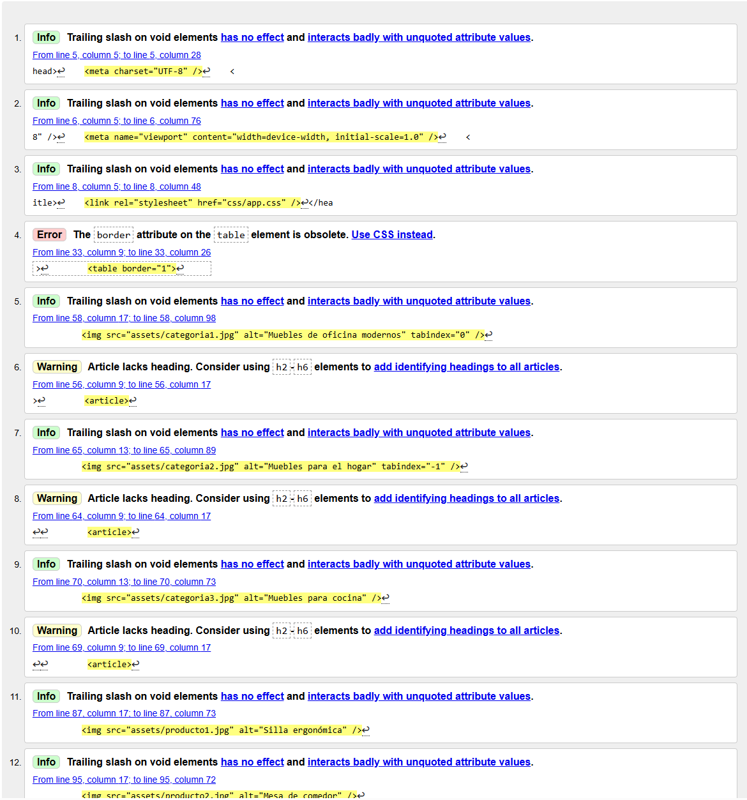

# Tecnologico de Costa Rica

Estudiante: Jose Andres Solano Vargas
Curso: Introduccion al desarrollo de sowftware

---

## 📑 Estructura Semántica

Lista de etiquetas clave utilizadas y su propósito:

- `<header>` – Encabezado principal del sitio, incluye el logo y navegación.
- `<nav>` – Menú de navegación entre secciones.
- `<main>` – Contenido principal de la página.
- `<section>` – Agrupación de contenido relacionado.
- `<article>` – Contenido independiente o destacado.
- `<footer>` – Información de contacto y pie de página.

---

## 🌐 URL pública (Netlify)

dancing-trifle-fa13da.netlify.app

---

## ✅ Validación W3C

**Captura:**  

**Resumen del html principal:**  
En su totalidad la estructura del index prinicpal es correcta, solo el caso de un mismo warning por falta de etiquetas heading(h2-h6). Ademas de un Error por el uso de border el cual aparentemente esta obsoleto.

**Captura:**  

**Resumen del html registro:**  
El registro no presento ningun warning ni error por lo que se optuvo un 100% de calificacion.

---

## 📊 Lighthouse

**Puntuaciones obtenidas:**

**Plan de mejoras:**

- Se debera arreglar los warning aunque estos no reflejen un problema significativo en el lightning.
- Se cambio el

---

## ♿ Accesibilidad Aplicada

Acciones implementadas para mejorar la accesibilidad del sitio:

- **`tabindex`** → _[Explica dónde y por qué lo usaste]_
- **`aria-*`** → _[Describe qué atributos aria utilizaste y en qué elementos]_
- **`alt`** en imágenes → _[Ejemplo de uso y justificación]_
- **Enlaces descriptivos** → _[Ejemplos de textos de enlace claros y accesibles]_

**Captura de ejemplo de accesibilidad:**  

